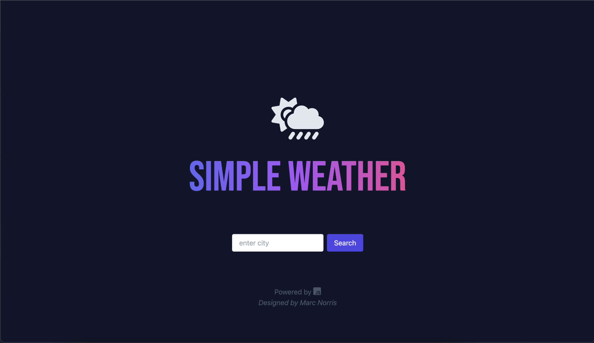
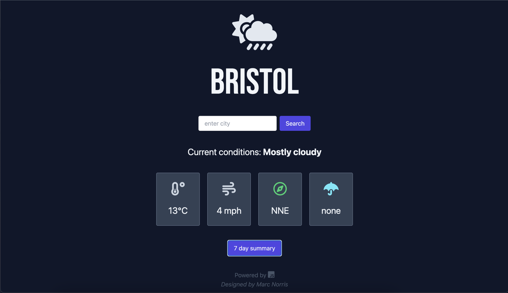

# Simple Weather App

## Simple weather application

This is a simple to use weather application without all of the clutter that many weather apps display.

This app is built with HTML, JavaScript & styled with TailwindCSS.

 

**Table of Contents:**

* [Usage](#usage)
* [Screenshots](#screenshots)
* [Credits](#credits)
* [License](#license)

 

# Usage

Visit the application here: https://shaky411.github.io/Current-Weather/

 

## Screenshots

 

## Credits

API provided by: https://www.meteosource.com/

 

## License

* _This application has the MIT Licence_
For more info, please go to the [licence description](https://opensource.org/license/mit/)
